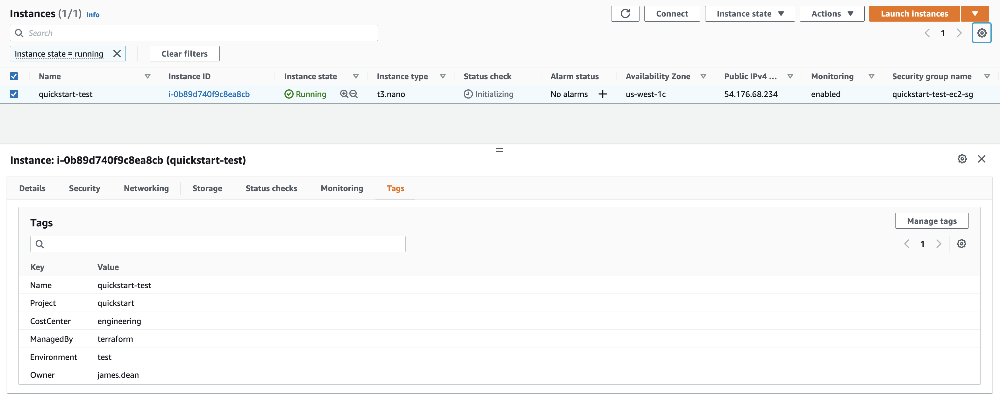

# Terraform AWS EC2 Module

This quick-start shows you how to implement your own AWS EC2 module.

## Info

In the `./example/` directory is a example `main.tf`:

```
module "example" {
  source = "../../../modules/ec2/"
 
  aws_region         = "us-west-1"
  aws_profile        = "default"
  project_identifier = "quickstart"
  keyname            = "ssh-default"
  selected_ami_type  = "amazon"
}

output "instance_id" {
  value = module.example.id
}

output "instance_ip" {
  value = module.example.ip
}
```

This module accepts parameters thats been referenced as variables from the module to provision a ec2 instance, which is useful for repeatability.

## Variables

The following variables can be passed as arguments to override the defaults:

Variable Name         | Description                            | Required  | Default Value
--------------------- | -------------------------------------- | --------- | -------------
`aws_profile`         | AWS Profile                            | True      | N/A
`keyname`             | SSH Key Pair                           | True      | N/A
`aws_region`          | AWS Region                             | False     | eu-west-1
`instance_type`       | EC2 Instance Type                      | False     | t3a.nano
`project_identifier`  | Your Project Name                      | False     | terraform-quick-start
`ebs_root_size_in_gb` | EBS Root Disk Size                     | False     | 20
`environment_name`    | Your Environment Name                  | False     | test
`team_name`           | Your Team Name                         | False     | engineering
`owner_name`          | Owner of this resource                 | False     | james.dean
`arch`                | The architecture type (aarch/x86_64)   | False     | x86_64
`selected_ami_type`   | The linux distribution (amazon/ubuntu) | True      | N/A

## Usage

This demonstrates the usage of this module inside the `example` directory:

```bash
cd example
terraform init
terraform plan
terraform apply

Apply complete! Resources: 7 added, 0 changed, 0 destroyed.

Outputs:

instance_id = "i-0b89d740f9c8ea8cb"
instance_ip = "54.176.68.234"
```

In the AWS Console:


